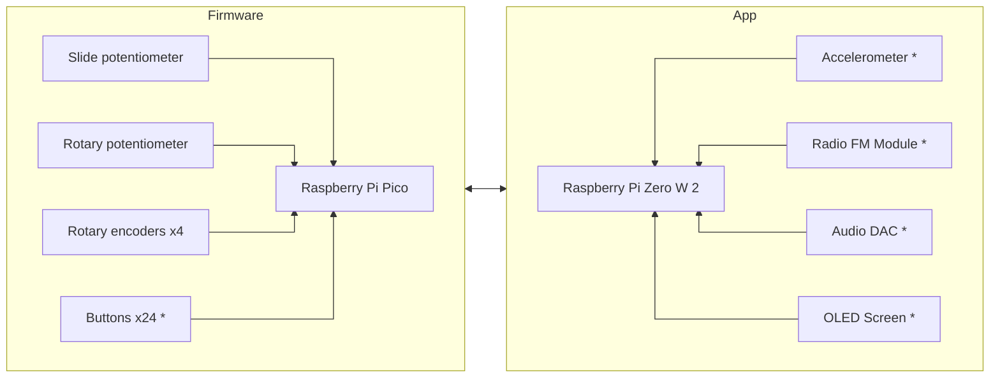

# Toy Synth
<!-- TODO: Rename to something cooler -->

> **Note**: This project is still in its early stages and is not ready for use.

This project is composed of multiple packages that can be used to create a toy synthesizer. The idea is to have a Raspberry Pi Pico that sends MIDI messages over USB to a Raspberry Pi Zero W 2 that runs a Rust application that generates sounds and has a nice visual interface.

This is the proposed hardware and software setup:

> **Note**: Components marked with * have not been bought or implemented yet.

* `firmware`: Firmware for a Raspberry Pi Pico that sends MIDI messages over USB
<!-- TODO: Rename app to something more descriptive -->
* `app`: Application that runs on a Raspberry Pi Zero W 2 that receives MIDI messages over USB and generates sounds
