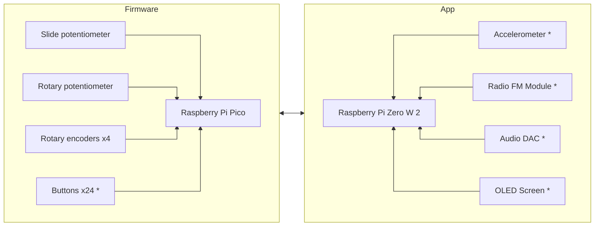

# Synth
<!-- TODO: Rename to something cooler -->

> **Note**: This project is still in its early stages and is not ready for use. ie it doesn't do anything yet and this repo is fairly empty.

This repo is composed of multiple projects that are used to make a Raspberry Pi based synthesizer. The aim of the project is to learn embedded and lower level programming with Rust, I have no idea what I'm doing. It is very much a work in progress, the idea is to have a Raspberry Pi Pico that sends MIDI messages over USB to a Raspberry Pi Zero W 2 that runs a Rust application that generates sounds and has a nice visual interface. 

This is the proposed hardware and software setup:

> **Note**: Components marked with * have not been bought or implemented yet.

* [`synth-firmware`](https://github.com/paullj/synth/blob/main/packages/firmware/README.md): Firmware for a Raspberry Pi Pico that sends MIDI messages over USB
<!-- TODO: Rename app to something more descriptive -->
* `synth-app`: Application that runs on a Raspberry Pi Zero W 2 that receives MIDI messages over USB and generates sounds

## Development
This project uses [just](https://github.com/casey/just) as a task runner. Once installed run `just` in the repo root to see the available tasks. You will also need to install [Rust](https://www.rust-lang.org/tools/install) and a few other dependencies, you can run `just check-setup` to check if you have everything installed.